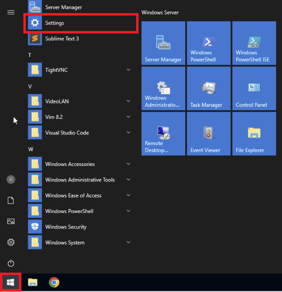
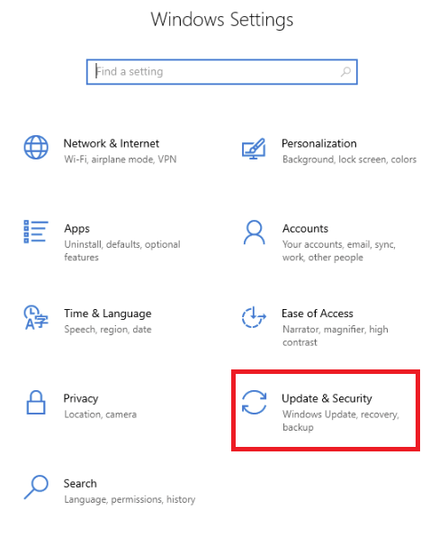
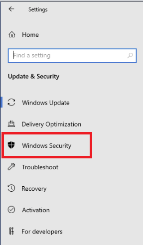
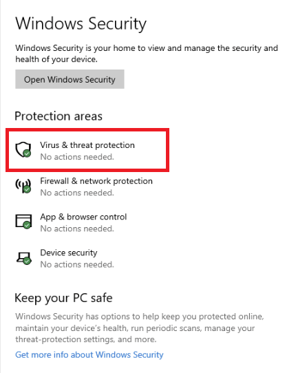
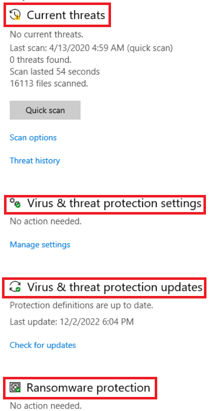
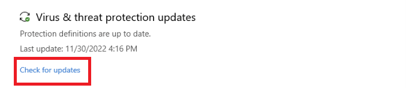
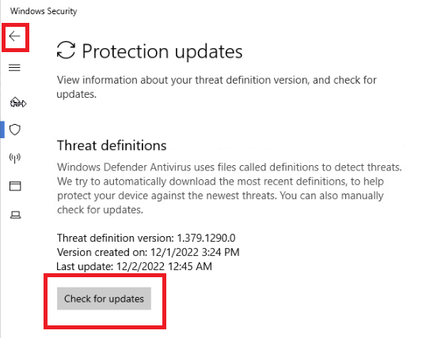
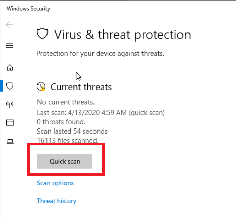
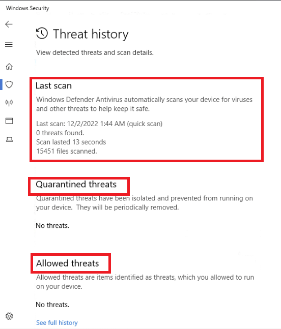

# Microsoft-Windows-Defender-and-Firewall

## **Review Windows Security Virus & threat protection**

1.Click the Windows **Start** button and select **Settings**.

2.On the Windows Settings page, select **Update & Security**.

3.Under Update & Security, select **Windows Security**.

4.Select **Virus and threat protection**.

5.On this screen, you’ll see the following features:

### **Current threats:** 
Here, you can see any threats that have been detected on your device. You can see when the last scan occurred, how long the scan took, and how many files were scanned. Here you can also click the button to start a quick scan or access **scan options** to run a full scan or a custom scan.

### **Virus & threat protection settings:** 
Here, you can access options for managing your virus and threat protection settings. You can customize your protection level, opt to send sample files to Microsoft, exclude files or folders from scans, or temporarily stop your protection.

### **Virus & threat protection updates:**
Here, you can view the last time your virus definitions were updated. You can also opt to manually check for updates.

### **Ransomware protection:** 
Here, you can choose to enable controlled folder access. This protects memory, files, and folders from unauthorized changes.

## **Update Threat Definitions**

Windows Security uses security intelligence, also known as definitions, to identify known threats. These definitions include information about known threats. These definitions are updated automatically, but if you suspect a problem with your system, you should ensure that threat definitions are up-to-date before you run a scan.

1.Under Virus & threat protection updates, select **Check for updates**.

2.You can view details for the most recent update to your threat definitions. Select **Check for updates**. This process could take a few minutes. When the update has completed, the **Check for updates** button will return, and you should notice that the last update time and date have changed. Select the back button to return to the **Virus & threat protection** screen.
Virus & threat protection screen.

## **Run Antivirus Quick Scan**
1.Now we can run an antivirus scan. Click the **Quick scan** button on the **Virus & threat protection** screen. The scan will take several minutes to run. When complete, the **Quick scan** button will reappear. Click **Threat history** to view any recent findings.

This page shows you the results of the last scan. You see the files identified as a threat and quarantined, so they cannot damage your device. You then see files identified as potential threats but allowed to continue running.
Threat history page shows Last scan results, Quarantined threats, and Allowed threats

